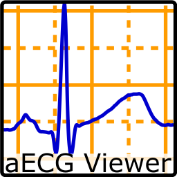
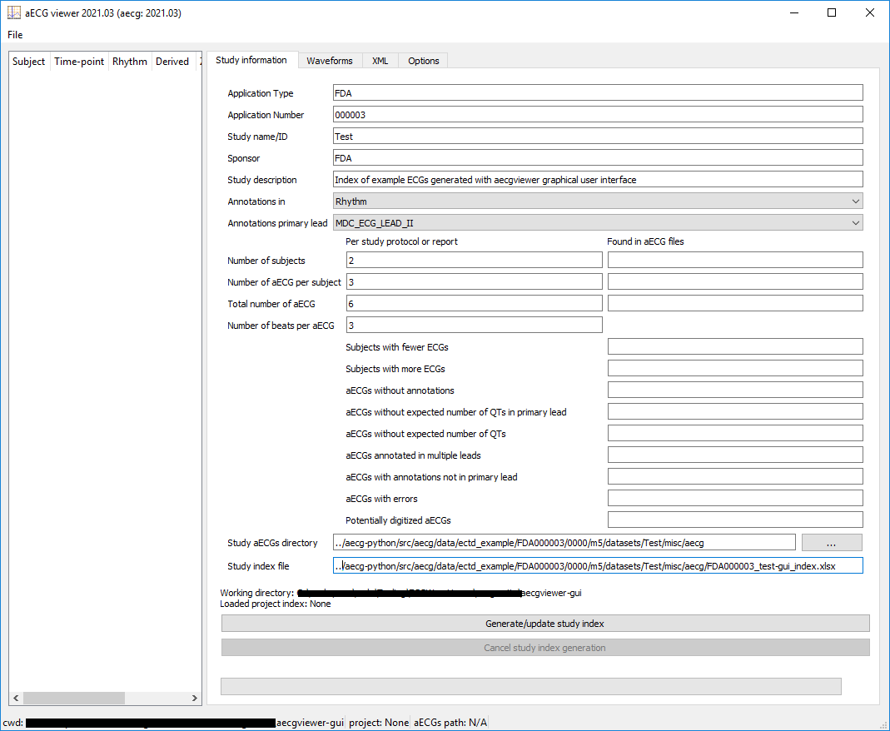
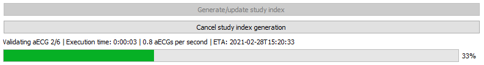
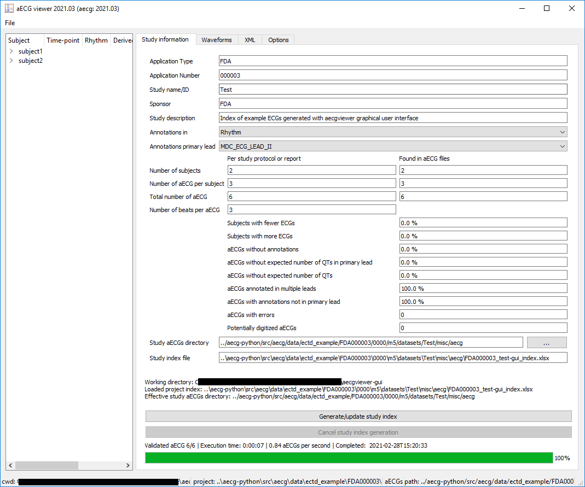
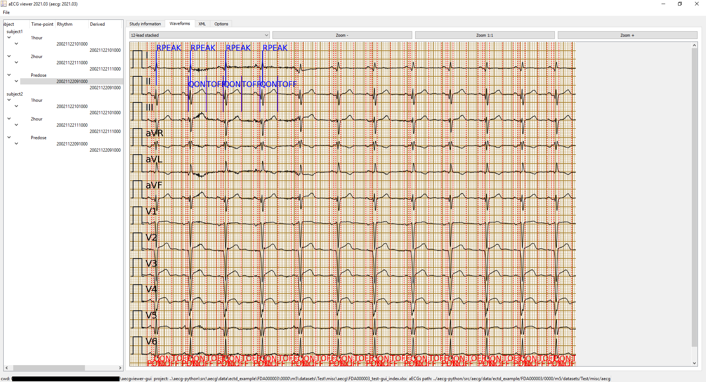
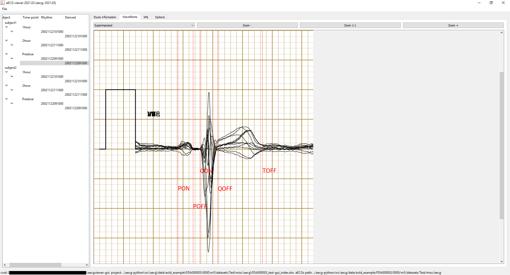

# Tutorial


This tutorial assumes you already installed the software and that have the adequate python or conda environment active. See the [README](README.md) file for instructions on how to install the software.

The sections below provide some examples of use of `aecgviewer` graphical user interface. You can launch the graphical user interface by typing `aecgviewer` in the command line after activating the adequate python or conda environment.

Similar to the *aecg* command line interface, *aecgviewer* logging system loads by default its configuration from the *aecgviewer_aecg_logging.conf* configuration file provided with the package. The default configuration writes the log data to *aecgviewer.log* in the current directory. In addition to a detailed log file, errors are printed to the console. The log file is a comma separated value file containing the following 6 columns: date and time (in ISO-8601) of the event, module recording the event, level or severity of the event, path to the aECG XML file, path to the Zip file containing the XML (None or empty string if none), message associated with the event.

## Creating an index of aECG files

To start the graphical user interface, activate the adequate python or conda environment and type `aecgviewer` in the command prompt.

```
aecgviewer
```

Once the user interface is opened, populate the information in the *Study Information* tab. The screenshot below shows the information populated for the Test study example described in the *tutorial* of *aecg* python package. This example assumes you launched `aecgviewer` from `~/code/aecgviewer` directory, so the path in *Study aECGs directory* starts with a *../aecg-python/* to point to the location of the example xml files. In addition, the *Study index file* (i.e., *oxslx* parameter in `aecg index`) name is set to 'FDA000003_test-**gui**_index.xlsx* to avoid overwriting the 'FDA000003_test-**cli**_index.xlsx* generated with `aecg index`. 




After the form is complete, click *Generate/Update study index* to launch an indexing task that will generate the specified study index file in the same way that `aecg index` command does. The progress bar at the bottom will show the indexing task progress. The indexing task can be stopped at any time by clicking on *Cancel study index generation*.



After the indexing process is complete, the specified *.xlsx* with the index of aECG waveforms found, interval measures, and summary statistics in corresponding sheets will be saved and loaded into the user interface. Summary statistics will be displayed under the *Found in aECG files* column, and the navigation tree on the left panel will be populated with the aECG waveforms by subject, time-point and date and time of collection. The status bar at the bottom of the main window will show the current working directory (i.e., directory from where the `aecgviewer` was started), the study index loaded, and the *effective* study aECGs directory used to load the aECG waveforms (see screenshot below).

Note about *Study aECGs directory*: In scenarios where the index is generated in a different machine or the index file and aECGs directory are moved, the *Study aECGs directory* in the index file might not be longer valid. In these cases, `aecgviewer` tries to find a valid *effective* study aECGs directory, which may be different from the *Study aECGs directory* specified in the form. The search for potential *effective* paths executed by `aecgviewer` is done in the following order: (1) path specified in the GUI; (2) use the specified path as relative path from the current working directory; (3) use the specified path as relative path from the directory where the index is located. A warning message will be shown if `aecgviewer` uses paths (2) or (3) instead of the specified *Study aECGs directory* path (1).




## Loading an existing index of aECG files

An index file generated with either *aecg index* or *aecgviewer* can be loaded by clicking on *File->Open study index* menu. The navigation tree and study information will be populated.

## Visualizing waveforms in a loaded index

First, create or load a study index following the steps on the sections above. The *Study information* tab as well as the *navigation tree* on the right and left panels, respectively, will display the information loaded from the index file. When clicking on a rhythm or derived (if available) annotated waveforms node of the *navigation tree*, the annotated ECG waveform will be displayed under the *Waveforms* tab on the right panel (see screenshots below). Use the controls in the *waveforms* tab to change the layout and zoom level of the display. Click on the *File->Save image* menu to export the displayed plot to .png or .pdf file. The corresponding raw XML file can be inspected by selecting the *XML* tab.




