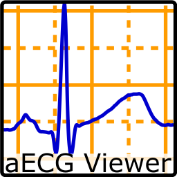

.. aecgviewer documentation master file, created by
   sphinx-quickstart on Mon Nov  9 12:49:08 2020.
   You can adapt this file completely to your liking, but it should at least
   contain the root `toctree` directive.

Welcome to aecgviewer's documentation!
======================================

Release v\ |version|

.. toctree::
   :maxdepth: 2
   :caption: Introduction

   README.md

   TUTORIAL.md

.. toctree::
   :maxdepth: 2
   :caption: Technical documentation

   aecgviewer

Indices and tables
==================

* :ref:`genindex`
* :ref:`modindex`
* :ref:`search`